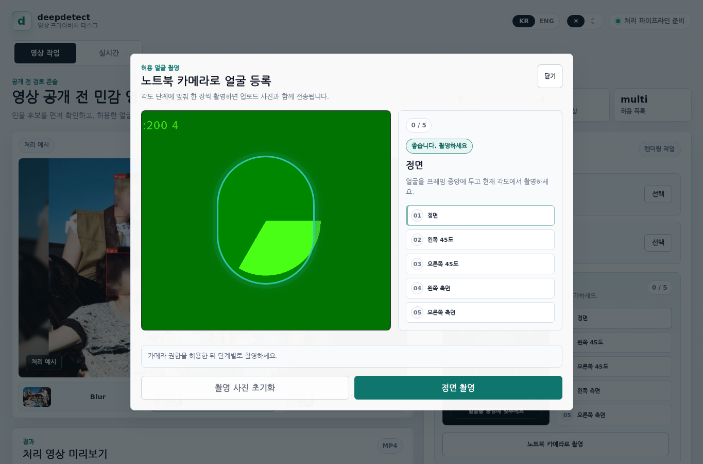
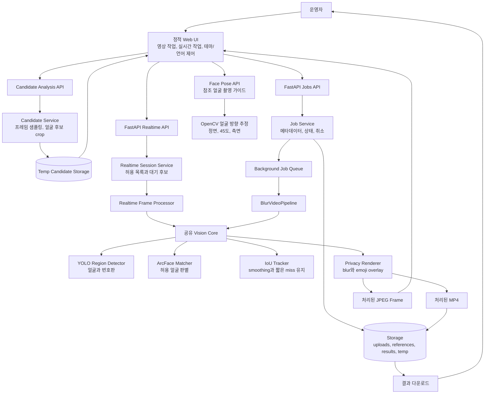

# deepdetect

[English](README.md) | [KR](README.ko.md)

deepdetect는 공개 전 영상을 검토하고 익명화하는 웹 작업 공간입니다. YOLO로 얼굴/번호판 위치를 찾고, 운영자가 허용할 인물을 선택한 뒤 나머지 개인정보 영역을 블러 처리한 결과 영상을 렌더링합니다.

현재 구현은 저장 영상 처리 품질을 우선하며, 브라우저 카메라 실시간 미리보기와 10초 이상 유지되는 블러 얼굴 허용 팝업도 제공합니다.

## UI 미리보기

한국어 라이트 영상 검토 콘솔:


한국어 얼굴 방향 판정 촬영 화면:



## 주요 기능

- 영상 파일 업로드 후 얼굴 후보를 먼저 추출
- 허용할 인물을 여러 명 선택하고 나머지 얼굴은 블러 처리
- 후보 감지가 부족할 때 수동 허용 얼굴 이미지 여러 장 업로드
- 노트북 카메라 촬영 또는 기존 이미지 업로드로 허용 얼굴 참조 사진 추가
- 거울 미리보기와 자동 슬롯 저장으로 정면, 45도, 측면 참조 얼굴 등록 지원
- 한 번 허용 인물로 매칭된 track은 이후 옆모습 점수가 낮아져도 원본 유지
- 저장 영상 작업과 실시간 미리보기를 분리된 서비스 화면으로 제공
- YOLO 기반 얼굴/번호판 감지
- 허용 인물 원본 유지 또는 스마일 이모지 대체
- IoU tracker와 box smoothing으로 이모지 흔들림 완화
- 브라우저 카메라 실시간 미리보기
- 실시간에서 블러 얼굴이 10초 이상 유지되면 추가 허용 여부 확인
- 결과 영상 다운로드
- 웹 UI KR/ENG 전환
- 해/달 토글 기반 라이트/다크 테마 전환

## 얼굴 등록 촬영 흐름

허용 인물 참조 사진은 기존 이미지 업로드와 노트북 카메라 촬영을 모두 지원합니다. 촬영 미리보기는 사용자가 자연스럽게 얼굴을 맞출 수 있도록 거울모드로 보여주지만, 방향 분석과 저장에 쓰는 프레임은 원래 카메라 방향을 유지합니다.

촬영 모달을 열면 브라우저가 카메라 프레임을 `/api/realtime/face-pose`로 보내고, 백엔드는 대략적인 얼굴 방향을 판정합니다. 감지된 방향이 비어 있는 참조 슬롯에 해당할 때 저장 버튼이 활성화됩니다.

참조 슬롯:

1. 정면
2. 한쪽 45도
3. 반대쪽 45도
4. 한쪽 측면
5. 반대쪽 측면

운영자는 위 순서를 그대로 따라갈 필요가 없습니다. 현재 감지된 각도의 슬롯이 비어 있으면 deepdetect가 해당 슬롯에 자동 저장합니다. 이미 저장된 각도라면 다른 각도로 천천히 돌리라는 안내가 표시됩니다.

이 방향 판정은 더 좋은 참조 사진을 얻기 위한 사용성 가이드입니다. 보안 인증 수준의 생체 등록 기능은 아닙니다.

## 샘플 검증 결과

샘플 QA는 공개 Xiph Derf `akiyo` 테스트 영상을 사용했습니다.

| 항목 | 결과 |
|---|---:|
| 처리한 샘플 프레임 | 90 |
| blur 모드 얼굴 감지 | 90 / 90 |
| blur 후 얼굴 영역 평균 선명도 감소율 | 98.05% |
| blur 후 얼굴 영역 최소 선명도 감소율 | 95.35% |
| preserve 모드 참조 인물 유지 | 90 / 90 |
| character 모드 이모지 오버레이 | 90 / 90 |

산출물:

- Blur 결과: [samples/outputs/akiyo_blur.mp4](samples/outputs/akiyo_blur.mp4)
- Preserve 결과: [samples/outputs/akiyo_preserve.mp4](samples/outputs/akiyo_preserve.mp4)
- 이모지 결과: [samples/outputs/akiyo_character.mp4](samples/outputs/akiyo_character.mp4)
- 프론트 쇼케이스 이미지: [samples/reports/group_showcase_contact_sheet.jpg](samples/reports/group_showcase_contact_sheet.jpg)
- Blur 수치 리포트: [samples/reports/akiyo_blur_quality.json](samples/reports/akiyo_blur_quality.json)

## 아키텍처



## 처리 모드

| Mode | 참조 인물 | 다른 얼굴 | 번호판 |
|---|---|---|---|
| `blur` | 블러 | 블러 | 블러 |
| `preserve` | 원본 유지 | 블러 | 블러 |
| `character` | 이모지 대체 | 블러 | 블러 |

웹 UI의 기본 흐름은 `preserve`, `character`를 제공합니다. 허용 얼굴을 선택하지 않으면 전체 블러 작업처럼 동작합니다.

## 프로젝트 구조

```text
backend/
  app/
    api/          FastAPI routes
    core/         settings, paths, security helpers
    services/     jobs, queue, realtime processing
    vision/       YOLO detector, matcher, tracker, renderer, pipeline
  tests/          unittest test suite
frontend/
  index.html      deepdetect UI
  src/app.js      영상/실시간 workflow, 테마와 언어 제어
  styles/app.css  responsive light/dark product styling
models/
  yolo/           face detector weights
  plate/          license plate detector weights
  face/           ArcFace ONNX model
samples/
  videos/         sample source and short clips
  references/     참조 얼굴과 UI 쇼케이스 원본 이미지
  outputs/        processed demo videos
  reports/        QA reports and screenshots
tools/
  prepare_sample.py
  run_sample_pipeline.py
  export_sample_contact_sheet.py
  export_frontend_assets.py
  measure_blur_quality.py
```

## 요구사항

- Python 3.11+
- OpenCV
- FastAPI
- Ultralytics YOLO
- `models/` 아래에 로컬로 배치한 모델 파일

의존성 설치:

```bash
python -m pip install -r requirements.txt
```

## 실행

```bash
python -m uvicorn backend.app.main:app --host 127.0.0.1 --port 8000
```

브라우저 접속:

```text
http://127.0.0.1:8000
```

## 모델 파일

기본 모델 경로:

```text
models/yolo/face_detector.pt
models/plate/license_plate_detector.pt
models/face/w600k_r50.onnx
```

모델 파일은 용량과 라이선스 제약 때문에 Git에는 포함하지 않습니다. 위 기본 경로에 호환되는 weight를 배치하거나 환경변수로 경로를 바꿔 실행합니다.

주요 환경변수:

```bash
EMBED_DETECTOR_MODE=auto
EMBED_YOLO_FACE_MODEL=models/yolo/face_detector.pt
EMBED_YOLO_PLATE_MODEL=models/plate/license_plate_detector.pt

EMBED_FACE_MATCHER_MODE=arcface
EMBED_FACE_MATCH_MODEL=models/face/w600k_r50.onnx
EMBED_FACE_MATCH_THRESHOLD=0.35

EMBED_TRACKER_ENABLED=true
EMBED_TRACKER_IOU_THRESHOLD=0.3
EMBED_TRACKER_SMOOTHING_ALPHA=0.55
EMBED_TRACKER_MAX_MISSING=2

EMBED_MAX_REALTIME_FRAME_BYTES=2097152
EMBED_MAX_REALTIME_FRAME_PIXELS=921600
EMBED_RESULT_TTL_SECONDS=86400
EMBED_CLEANUP_INTERVAL_SECONDS=60
```

## 샘플 QA 실행

샘플 준비:

```bash
python tools/prepare_sample.py --max-frames 90
```

모드별 실행:

```bash
python tools/run_sample_pipeline.py --mode blur --output samples/outputs/akiyo_blur.mp4 --report samples/reports/akiyo_blur.json
python tools/run_sample_pipeline.py --mode preserve --output samples/outputs/akiyo_preserve.mp4 --report samples/reports/akiyo_preserve.json
python tools/run_sample_pipeline.py --mode character --output samples/outputs/akiyo_character.mp4 --report samples/reports/akiyo_character.json
```

시각 QA와 blur 수치 측정:

```bash
python tools/export_sample_contact_sheet.py
python tools/measure_blur_quality.py
```

## API 요약

| Method | Path | 목적 |
|---|---|---|
| `GET` | `/api/health` | Health check |
| `POST` | `/api/jobs/video/candidates` | 영상 업로드와 얼굴 후보 추출 |
| `GET` | `/api/jobs/video/candidates/{analysis_id}/{candidate_id}` | 얼굴 후보 crop 조회 |
| `POST` | `/api/jobs/video/from-candidates` | 선택한 후보로 렌더링 작업 생성 |
| `POST` | `/api/jobs/video` | 영상과 수동 허용 얼굴 업로드로 작업 생성 |
| `GET` | `/api/jobs/{job_id}` | 작업 상태 조회 |
| `POST` | `/api/jobs/{job_id}/cancel` | 작업 취소 |
| `GET` | `/api/jobs/{job_id}/result` | 결과 영상 다운로드 |
| `POST` | `/api/realtime/sessions` | 수동 허용 얼굴을 포함한 실시간 처리 세션 생성 |
| `POST` | `/api/realtime/face-pose` | 참조 얼굴 촬영용 대략적인 얼굴 방향 판정 |
| `POST` | `/api/realtime/frame-meta` | 카메라 프레임 처리와 후보 팝업 데이터 반환 |
| `POST` | `/api/realtime/frame` | 카메라 프레임 1장 처리 |
| `POST` | `/api/realtime/sessions/{session_id}/allow-face` | 실시간 후보 얼굴을 허용 목록에 추가 |
| `WS` | `/api/realtime/sessions/{session_id}/ws` | 실시간 websocket frame endpoint |

## 테스트

```bash
python -m unittest discover -s backend/tests -v
node --check frontend/src/app.js
```

현재 검증 상태:

- 백엔드 테스트 49개 통과
- 프론트엔드 문법 검사 통과
- Playwright로 데스크톱/모바일 UI 렌더링 확인
- 샘플 영상 기준 blur 결과를 시각 자료와 선명도 감소율로 확인

## 한계

- 너무 작거나 멀거나 심하게 가려진 얼굴은 놓칠 수 있습니다.
- 저장 영상 후보 분석은 현재 요청 중에 실행되므로 큰 업로드에서는 백그라운드 분석 작업으로 분리하는 것이 좋습니다.
- 실시간 허용 팝업은 tracker 기반이므로 의도한 동작을 위해 tracker를 켜두는 것이 좋습니다.
- 번호판 처리 품질은 선택한 번호판 YOLO 모델과 대상 지역/영상 품질에 영향을 받습니다.
- 참조 인물 판별은 시연/서비스 품질 목적이며 보안 인증 수준의 얼굴 인증이 아닙니다.
- 카메라 방향 판정은 2D 웹캠 기반의 대략적인 추정이므로 조명, 카메라 각도, 얼굴 크기에 영향을 받습니다.
- Apple 이모지 asset은 포함하지 않습니다. 기본 이모지는 자체 생성한 스마일 스타일 asset입니다.

## Roadmap

- 번호판이 잘 보이는 차량 샘플을 추가해 plate blur QA 수행
- 사용자 업로드 캐릭터 asset 지원
- frame skipping, batching, ONNX/TensorRT/OpenVINO로 실시간 처리량 개선
- 최종 임베디드 보드용 실행 프로파일 추가

## License

MIT License입니다. 자세한 내용은 [LICENSE](LICENSE)를 확인하세요.
