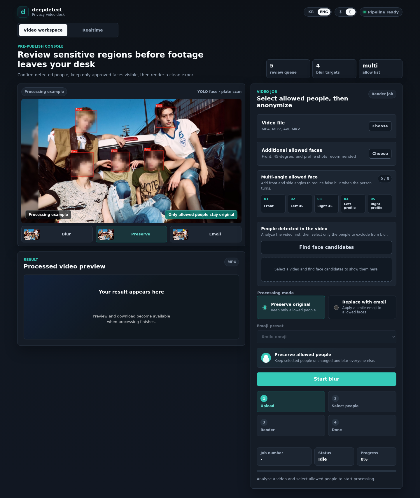
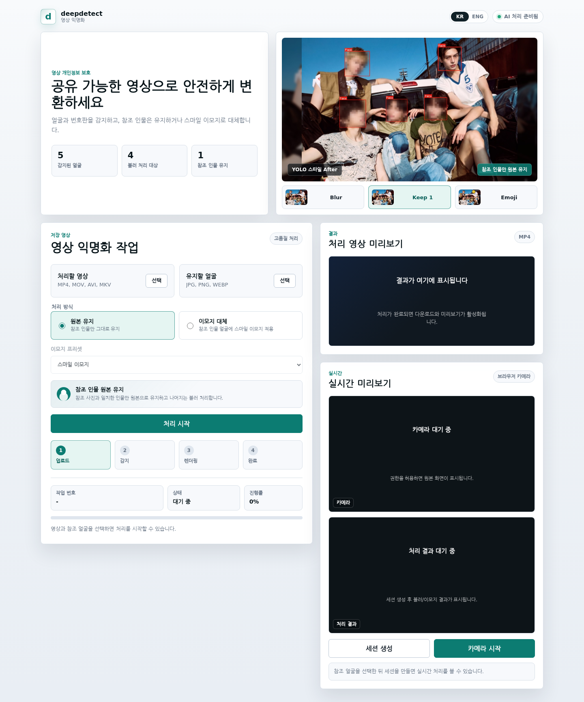
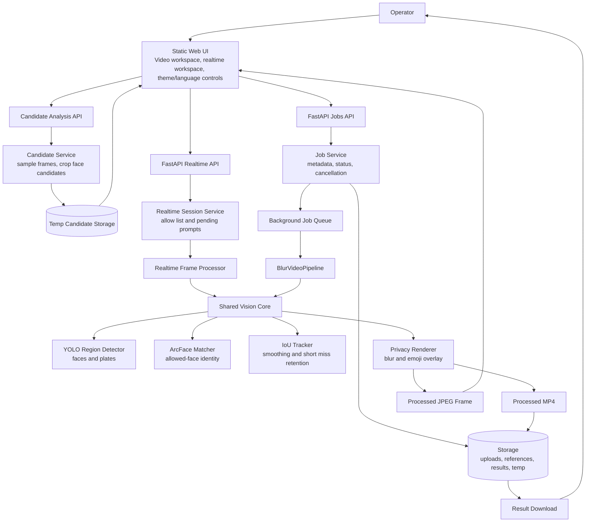

# deepdetect

[English](README.md) | [KR](README.ko.md)

deepdetect is a privacy video review workspace. It detects faces and license plates with YOLO, lets the operator choose which people are allowed to remain visible, then renders a clean video export.

The current build prioritizes saved-video quality and includes a browser-camera realtime preview with an allow-person prompt for long-running blurred faces.

## UI Preview

English dark video review console:



Korean light video review console:



## Features

- Upload a video and detect face candidates before rendering.
- Select one or more people to allow; everyone else stays blurred.
- Upload multiple manual allow-list face images when candidate detection is not enough.
- Capture allow-list reference photos from the laptop camera or upload existing images.
- Guide operators to add front, 45-degree, and profile reference faces, with camera pose checks before capture.
- Keep an already matched reference track visible even when a later side angle scores lower.
- Keep saved-video work and realtime preview in separate product surfaces.
- Detect faces and license plates using YOLO model wrappers.
- Preserve allowed people or replace allowed faces with a smile emoji overlay.
- Keep emoji overlays stable with IoU tracking and bounding-box smoothing.
- Preview realtime processing from the browser camera.
- Ask whether to allow a blurred realtime face after it remains visible for 10 seconds.
- Download the processed result video.
- Switch the web UI between KR and ENG.
- Toggle the product UI between light and dark themes.

## Demo Evidence

The sample QA run uses the public Xiph Derf `akiyo` test sequence.

| Check | Result |
|---|---:|
| Sample frames processed | 90 |
| Face detections in blur mode | 90 / 90 |
| Average face-region sharpness reduction after blur | 98.05% |
| Minimum face-region sharpness reduction after blur | 95.35% |
| Preserve-mode reference matches | 90 / 90 |
| Emoji overlays | 90 / 90 |

Artifacts:

- Blur result: [samples/outputs/akiyo_blur.mp4](samples/outputs/akiyo_blur.mp4)
- Preserve result: [samples/outputs/akiyo_preserve.mp4](samples/outputs/akiyo_preserve.mp4)
- Emoji result: [samples/outputs/akiyo_character.mp4](samples/outputs/akiyo_character.mp4)
- Frontend showcase sheet: [samples/reports/group_showcase_contact_sheet.jpg](samples/reports/group_showcase_contact_sheet.jpg)
- Blur metrics: [samples/reports/akiyo_blur_quality.json](samples/reports/akiyo_blur_quality.json)

## Architecture



## Processing Modes

| Mode | Reference person | Other faces | License plates |
|---|---|---|---|
| `blur` | blurred | blurred | blurred |
| `preserve` | kept original | blurred | blurred |
| `character` | replaced with emoji | blurred | blurred |

The web UI exposes `preserve` and `character` for the main product flow. With no allowed faces selected, the render behaves as a blur-all privacy pass.

## Project Layout

```text
backend/
  app/
    api/          FastAPI routes
    core/         settings, paths, security helpers
    services/     jobs, queue, realtime processing
    vision/       YOLO detector, matcher, tracker, renderer, pipeline
  tests/          unittest test suite
frontend/
  index.html      deepdetect UI
  src/app.js      video/realtime workflows, theme and language controls
  styles/app.css  responsive light/dark product styling
models/
  yolo/           face detector weights
  plate/          license plate detector weights
  face/           ArcFace ONNX model
samples/
  videos/         sample source and short clips
  references/     reference faces and UI showcase source image
  outputs/        processed demo videos
  reports/        QA reports and screenshots
tools/
  prepare_sample.py
  run_sample_pipeline.py
  export_sample_contact_sheet.py
  export_frontend_assets.py
  measure_blur_quality.py
```

## Requirements

- Python 3.11+
- OpenCV
- FastAPI
- Ultralytics YOLO
- Model files placed locally under `models/`

Install dependencies:

```bash
python -m pip install -r requirements.txt
```

## Run

```bash
python -m uvicorn backend.app.main:app --host 127.0.0.1 --port 8000
```

Open:

```text
http://127.0.0.1:8000
```

## Model Files

Default model paths:

```text
models/yolo/face_detector.pt
models/plate/license_plate_detector.pt
models/face/w600k_r50.onnx
```

Model weights are intentionally ignored by Git because of size and license constraints. Place compatible weights at the default paths above, or override the paths with environment variables.

Useful environment variables:

```bash
EMBED_DETECTOR_MODE=auto
EMBED_YOLO_FACE_MODEL=models/yolo/face_detector.pt
EMBED_YOLO_PLATE_MODEL=models/plate/license_plate_detector.pt

EMBED_FACE_MATCHER_MODE=arcface
EMBED_FACE_MATCH_MODEL=models/face/w600k_r50.onnx
EMBED_FACE_MATCH_THRESHOLD=0.35

EMBED_TRACKER_ENABLED=true
EMBED_TRACKER_IOU_THRESHOLD=0.3
EMBED_TRACKER_SMOOTHING_ALPHA=0.55
EMBED_TRACKER_MAX_MISSING=2

EMBED_MAX_REALTIME_FRAME_BYTES=2097152
EMBED_MAX_REALTIME_FRAME_PIXELS=921600
EMBED_RESULT_TTL_SECONDS=86400
EMBED_CLEANUP_INTERVAL_SECONDS=60
```

## Sample QA Workflow

Prepare the sample:

```bash
python tools/prepare_sample.py --max-frames 90
```

Run all demo modes:

```bash
python tools/run_sample_pipeline.py --mode blur --output samples/outputs/akiyo_blur.mp4 --report samples/reports/akiyo_blur.json
python tools/run_sample_pipeline.py --mode preserve --output samples/outputs/akiyo_preserve.mp4 --report samples/reports/akiyo_preserve.json
python tools/run_sample_pipeline.py --mode character --output samples/outputs/akiyo_character.mp4 --report samples/reports/akiyo_character.json
```

Export visual QA and blur metrics:

```bash
python tools/export_sample_contact_sheet.py
python tools/measure_blur_quality.py
```

## API Summary

| Method | Path | Purpose |
|---|---|---|
| `GET` | `/api/health` | Health check |
| `POST` | `/api/jobs/video/candidates` | Upload video and extract face candidates |
| `GET` | `/api/jobs/video/candidates/{analysis_id}/{candidate_id}` | Read a candidate face crop |
| `POST` | `/api/jobs/video/from-candidates` | Create a render job from selected candidates |
| `POST` | `/api/jobs/video` | Upload video and optional manual allow-list references |
| `GET` | `/api/jobs/{job_id}` | Read job status |
| `POST` | `/api/jobs/{job_id}/cancel` | Cancel a job |
| `GET` | `/api/jobs/{job_id}/result` | Download processed video |
| `POST` | `/api/realtime/sessions` | Create realtime processing session with optional allow-list references |
| `POST` | `/api/realtime/face-pose` | Estimate coarse face direction for guided reference capture |
| `POST` | `/api/realtime/frame-meta` | Process one camera frame and return prompt candidates |
| `POST` | `/api/realtime/frame` | Process one camera frame |
| `POST` | `/api/realtime/sessions/{session_id}/allow-face` | Add a prompted realtime face to the allow list |
| `WS` | `/api/realtime/sessions/{session_id}/ws` | Realtime websocket frame endpoint |

## Tests

```bash
python -m unittest discover -s backend/tests -v
node --check frontend/src/app.js
```

Current verification:

- Backend tests: 49 passing.
- Frontend syntax check: passing.
- Browser rendering checked with Playwright for desktop and mobile.
- Blur sample QA checked visually and with sharpness metrics.

## Limitations

- Small, far, heavily occluded, or partial faces may be missed.
- Saved-video candidate analysis currently runs during the request and should be moved to a background analysis job for larger uploads.
- Realtime allow prompts depend on tracking; keep the tracker enabled for the intended prompt behavior.
- License plate quality depends on the selected plate YOLO model and target region.
- Reference-person matching is pragmatic, not a security-grade identity system.
- Apple emoji assets are not bundled; the default emoji is a custom generated smile asset.

## Roadmap

- Add a traffic sample with visible license plates for plate blur QA.
- Add user-uploaded custom character assets.
- Improve realtime throughput with frame skipping, batching, or ONNX/TensorRT/OpenVINO backends.
- Add a deployment profile for the final embedded target.

## License

MIT License. See [LICENSE](LICENSE).
